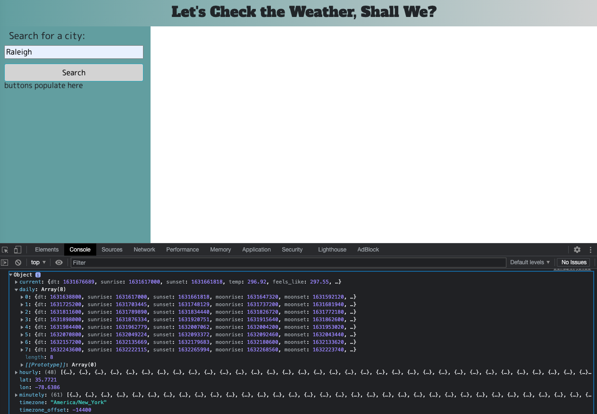

# Coding Quiz #

This project's purpose is to check the current and future weather.

You can access this project here: https://benwofford.github.io/weather-dashboard/

## Build Status ##

Unfortunately the div's containing the weather information will not populate.

## Screenshots ##

I've managed to assemble the functions that pull the info from the API's but I can't get the fields containing the data to populate, see below;

## Features ##

Once functional this site will provide the current and a 5 day forecast.

## Code Example ##

--

## Installation ##

--
## How To Use ##

--

## Contribute ##

--

## Credits ##

--

## License ##

--
